# \[spec-001\] Class Composition with Partial Classes

This language-agnostic document introduces a convention for structuring individual classes using partial classes. It focuses on simplifying class definitions by splitting them into manageable parts, enhancing modularity and maintainability.

In a separate specification, we will explore how to extend this approach across groups of classes, which is particularly useful when partials represent features in a project or package.

## Background

Partial classes allow you to split a single class definition across multiple source files. Each partial class contains a portion of the overall class, and all parts are combined to form the complete class. This approach helps manage complex classes by dividing them into smaller, more manageable pieces.

Example:


Using partial classes is beneficial in several scenarios:

- **Modularity**: Large classes can be broken down into smaller sections for easier understanding and maintenance.
- **Organization**: Related methods can be grouped together, improving code structure.
- **Collaboration**: Multiple developers can work on different parts simultaneously, reducing merge conflicts.

## Support in Programming Languages

Some programming languages, like C#, provide built-in support for partial classes using the `partial` keyword. This feature allows you to split a class definition across multiple files, which are then combined at compile time.

In languages without native support for partial classes, such as Python, similar modularity can be achieved through traits, mixins, multiple inheritance, or single inheritance composition.

In this specification, "partial classes" refers to splitting a class into multiple parts for better organization and modularity, with the parts combined at the source code level rather than at compile time.

## Specification

This convention introduces a method for structuring classes using partial classes, involving three main components:

1. **🥣 Base Class**: Contains the core functionality.
2. **🍅 Partial Classes**: Add additional functionalities.
3. **🥗 Composed Class**: Combines the base class and partials into a single class.

An example of a composed class:

```mermaid
---
title: "🥗 Composed = 🥣 Base + 🍅 Partial1 + 🍅 Partial2 + ... + 🍅 PartialN"
config:
    class:
        hideEmptyMembersBox: true
---
classDiagram
    class Base_["🥣 CatBase"] {
        <<base>>
        +set_name(name)
        +get_name()
    }

    class Partial1_["🍅 WithAge"] {
        <<partial>>
        +set_age(age)
        +get_age()
    }

    class Partial2_["🍅 WithAgility"] {
        <<partial>>
        +set_agility(agility)
        +get_agility()
    }

    class Composed_["🥗 Cat"] {
        <<composed>>
    }

    %% Relationships
    Base_     <|-- Composed_ : extends
    Partial1_ <|-- Composed_ : extends
    Partial2_ <|-- Composed_ : extends

    %% Apply Styles
    style Base_ fill:#6060ff20, stroke-dasharray: 5 5
    style Composed_ bugfix:#111, stroke-width:2px, font-weight: bold
    style External1 bugfix:#111, stroke-width:2px, font-weight: bold
    style Partial1_ fill:#60ff6020, stroke-dasharray: 5 5
    style Partial2_ fill:#60ff6020, stroke-dasharray: 5 5
    style Partial3_ fill:#60ff6020, stroke-dasharray: 5 5
    style Partial4_ fill:#60ff6020, stroke-dasharray: 5 5
    style Interface1 fill:#ff606020, stroke-dasharray: 2 2
    style Interface2 fill:#ff606020, stroke-dasharray: 2 2
    style Interface3 fill:#ff606020, stroke-dasharray: 2 2
    style Interface4 fill:#ff606020, stroke-dasharray: 2 2
```



In this convention:

- The base class (`CatBase`) includes essential methods.
- Partial classes are named using the pattern `With<PartialName>` (e.g., `WithAge`, `WithAgility`).
- The composed class (`Cat`) extends the base class and incorporates all partials.

### File Structure

The recommended file structure:

```pseudo
<class_name>/
├── 🥣 <class_name>_base.lang       # Base class with core functionality
│
├── 📁 partials/                    # Contains all partial implementations
│   ├── 🍅 with_<partial1>.lang     # Partial 1
│   ├── ...                         # Additional partial classes
│   └── 🍅 with_<partialN>.lang     # Partial N
│
└── 🥗 <class_name>.lang            # Composed class: base + partials
```

Notes:

- `<class_name>` is your class name (e.g., `Cat`).
- `.lang` represents the language-specific extension (e.g., `.py`, `.cs`).
- Adjust naming conventions to match your programming language's standards.

### One-to-One Interface Mapping

To enhance type safety and ensure consistent method implementation, each class must have a corresponding interface. This applies to:

- **Base Class**
- **Partial Classes**
- **Composed Class**

```pseudo
<class_name>/
├── ...
├── 🥣 <class_name>_base_interface.lang     # Interface for the base class
│
├── 📁 partials/
│   ├── 🍅 with_<partial1>_interface.lang   # Partial 1 interface
│   ├── ...
│   └── 🍅 with_<partialN>_interface.lang   # Partial N interface
│
└── 🥗 <class_name>_interface.lang          # Composed interface: base + partial interfaces
```

Interfaces are named by appending `Interface` to the class name, for example:

- `CatBase` → `CatBaseInterface`
- `WithAge` → `WithAgeInterface`
- `Cat` → `CatInterface`

### Implementation Details

#### Base Class

The **base class** serves as a special partial containing the core functionality.

##### Base Class Interface

Interfaces should only list method signatures without any concrete implementations. This applies to all interfaces, including the base class interface.

```mermaid
---
config:
    class:
        hideEmptyMembersBox: true
---
classDiagram
    class Interface1["🥣 CatBaseInterface"] {
        <<interface>>
        +set_name(name)
        +get_name()
    }

    %% Apply Styles
    style Base_ fill:#6060ff20, stroke-dasharray: 5 5
    style Composed_ bugfix:#111, stroke-width:2px, font-weight: bold
    style External1 bugfix:#111, stroke-width:2px, font-weight: bold
    style Partial1_ fill:#60ff6020, stroke-dasharray: 5 5
    style Partial2_ fill:#60ff6020, stroke-dasharray: 5 5
    style Partial3_ fill:#60ff6020, stroke-dasharray: 5 5
    style Partial4_ fill:#60ff6020, stroke-dasharray: 5 5
    style Interface1 fill:#ff606020, stroke-dasharray: 2 2
    style Interface2 fill:#ff606020, stroke-dasharray: 2 2
    style Interface3 fill:#ff606020, stroke-dasharray: 2 2
    style Interface4 fill:#ff606020, stroke-dasharray: 2 2
```

Base interfaces are named using `<ClassName>BaseInterface`. For example:



##### Concrete Base Class

Concrete classes inherit from their interface, renamed as `ImplementsInterface`. This applies to all concrete classes, including the base class.

```mermaid
---
config:
    class:
        hideEmptyMembersBox: true
---
classDiagram
    namespace Interface {
        class Interface1["🥣 CatBaseInterface"] {
            <<interface>>
            +set_name(name)
            +get_name()
        }
    }

    class Base_["🥣 CatBase"] {
        <<base>>
        +set_name(name)
        +get_name()
    }

    %% Relationships
    Interface1 <|-- Base_ : implements "ImplementsInterface"

    %% Apply Styles
    style Base_ fill:#6060ff20, stroke-dasharray: 5 5
    style Composed_ bugfix:#111, stroke-width:2px, font-weight: bold
    style External1 bugfix:#111, stroke-width:2px, font-weight: bold
    style Partial1_ fill:#60ff6020, stroke-dasharray: 5 5
    style Partial2_ fill:#60ff6020, stroke-dasharray: 5 5
    style Partial3_ fill:#60ff6020, stroke-dasharray: 5 5
    style Partial4_ fill:#60ff6020, stroke-dasharray: 5 5
    style Interface1 fill:#ff606020, stroke-dasharray: 2 2
    style Interface2 fill:#ff606020, stroke-dasharray: 2 2
    style Interface3 fill:#ff606020, stroke-dasharray: 2 2
    style Interface4 fill:#ff606020, stroke-dasharray: 2 2
```



##### Alternative: Base Class as Marker

Alternatively, the base class can be left empty, acting as a marker, with core functionalities moved to a partial class:

```mermaid
---
config:
    class:
        hideEmptyMembersBox: true
---
classDiagram
    namespace Interface {
        class Interface1["🥣 CatBaseInterface"] {
            <<empty>>
            %% Empty interface
        }
    }

    class Base_["🥣 CatBase"] {
        <<empty>>
        %% Empty class
    }

    %% Notes
    note "The base class (both concrete and interface) does not contain any methods."

    %% Relationships
    Interface1 <|-- Base_ : implements "ImplementsInterface"

    %% Apply Styles
    style Base_ fill:#6060ff20, stroke-dasharray: 5 5
    style Composed_ bugfix:#111, stroke-width:2px, font-weight: bold
    style External1 bugfix:#111, stroke-width:2px, font-weight: bold
    style Partial1_ fill:#60ff6020, stroke-dasharray: 5 5
    style Partial2_ fill:#60ff6020, stroke-dasharray: 5 5
    style Partial3_ fill:#60ff6020, stroke-dasharray: 5 5
    style Partial4_ fill:#60ff6020, stroke-dasharray: 5 5
    style Interface1 fill:#ff606020, stroke-dasharray: 2 2
    style Interface2 fill:#ff606020, stroke-dasharray: 2 2
    style Interface3 fill:#ff606020, stroke-dasharray: 2 2
    style Interface4 fill:#ff606020, stroke-dasharray: 2 2
```



#### Partials

**Partials** add additional functionalities to the composed class.

##### Partial Interfaces

```mermaid
---
config:
    class:
        hideEmptyMembersBox: true
---
classDiagram
    namespace Base {
        class Interface1["🥣 CatBaseInterface"] {
            <<interface>>
            +set_name(name)
            +get_name()
        }
    }

    class Interface2["🍅 WithAgeInterface"] {
        <<interface>>
        +set_age(age)
        +get_age()
    }

    %% Relationships
    Interface1 <|-- Interface2 : extends "WithBaseInterface"

    %% Apply Styles
    style Base_ fill:#6060ff20, stroke-dasharray: 5 5
    style Composed_ bugfix:#111, stroke-width:2px, font-weight: bold
    style External1 bugfix:#111, stroke-width:2px, font-weight: bold
    style Partial1_ fill:#60ff6020, stroke-dasharray: 5 5
    style Partial2_ fill:#60ff6020, stroke-dasharray: 5 5
    style Partial3_ fill:#60ff6020, stroke-dasharray: 5 5
    style Partial4_ fill:#60ff6020, stroke-dasharray: 5 5
    style Interface1 fill:#ff606020, stroke-dasharray: 2 2
    style Interface2 fill:#ff606020, stroke-dasharray: 2 2
    style Interface3 fill:#ff606020, stroke-dasharray: 2 2
    style Interface4 fill:#ff606020, stroke-dasharray: 2 2
```

Partial interfaces must import the base interface, renaming it to `WithBaseInterface` for consistency. They are named `With<PartialName>Interface`:



##### Dependency on Other Partials

If a partial depends on other partials, its interface must also import those partials' interfaces. For example, `WithAgilityInterface` depends on `WithAgeInterface`:

```mermaid
---
config:
    class:
        hideEmptyMembersBox: true
---
classDiagram
    namespace Base {
        class Interface1["🥣 CatBaseInterface"] {
            <<interface>>
            +set_name(name)
            +get_name()
        }
    }

    namespace Partial1 {
        class Interface2["🍅 WithAgeInterface"] {
            <<interface>>
            +set_age(age)
            +get_age()
        }
    }

    namespace PartialN {
        class Interface3["🍅 With...Interface"] {
            <<interface>>
            +...()
        }
    }

    class Interface4["🍅 WithAgilityInterface"] {
        <<interface>>
        +set_agility(agility)
        +get_agility()
    }

    %% Relationships
    Interface1 <|-- Interface4 : extends "WithBaseInterface"
    Interface2 <|-- Interface4 : extends
    Interface3 <|-- Interface4 : extends

    %% Apply Styles
    style Base_ fill:#6060ff20, stroke-dasharray: 5 5
    style Composed_ bugfix:#111, stroke-width:2px, font-weight: bold
    style External1 bugfix:#111, stroke-width:2px, font-weight: bold
    style Partial1_ fill:#60ff6020, stroke-dasharray: 5 5
    style Partial2_ fill:#60ff6020, stroke-dasharray: 5 5
    style Partial3_ fill:#60ff6020, stroke-dasharray: 5 5
    style Partial4_ fill:#60ff6020, stroke-dasharray: 5 5
    style Interface1 fill:#ff606020, stroke-dasharray: 2 2
    style Interface2 fill:#ff606020, stroke-dasharray: 2 2
    style Interface3 fill:#ff606020, stroke-dasharray: 2 2
    style Interface4 fill:#ff606020, stroke-dasharray: 2 2
```



##### Concrete Partial Classes

Concrete partial classes inherit only from their own `ImplementsInterface`:

```mermaid
---
config:
    class:
        hideEmptyMembersBox: true
---
classDiagram
    namespace Interface {
        class Interface1["🍅 WithAgeInterface"] {
            <<interface>>
            +set_age(age)
            +get_age()
        }
    }

    class Partial1_["🍅 WithAge"] {
        <<partial>>
        +set_age(age)
        +get_age()
    }

    %% Relationships
    Interface1 <|-- Partial1_ : implements "ImplementsInterface"

    %% Apply Styles
    style Base_ fill:#6060ff20, stroke-dasharray: 5 5
    style Composed_ bugfix:#111, stroke-width:2px, font-weight: bold
    style External1 bugfix:#111, stroke-width:2px, font-weight: bold
    style Partial1_ fill:#60ff6020, stroke-dasharray: 5 5
    style Partial2_ fill:#60ff6020, stroke-dasharray: 5 5
    style Partial3_ fill:#60ff6020, stroke-dasharray: 5 5
    style Partial4_ fill:#60ff6020, stroke-dasharray: 5 5
    style Interface1 fill:#ff606020, stroke-dasharray: 2 2
    style Interface2 fill:#ff606020, stroke-dasharray: 2 2
    style Interface3 fill:#ff606020, stroke-dasharray: 2 2
    style Interface4 fill:#ff606020, stroke-dasharray: 2 2
```



##### Concrete Partial with Dependencies on Other Partials

For partials depending on other partials, inherit only from `ImplementsInterface`:


##### Concrete Partial with External Dependencies

Concrete partial classes can also inherit from external concrete classes like traits:


#### Composed Class

The **composed class** combines the base class and all partials.

##### Composed Class Interface

```mermaid
---
config:
    class:
        hideEmptyMembersBox: true
---
classDiagram
    namespace Base {
        class Interface1["🥣 CatBaseInterface"] {
            <<interface>>
            +set_name(name)
            +get_name()
        }
    }

    namespace Partial1 {
        class Interface2["🍅 WithAgeInterface"] {
            <<interface>>
            +set_age(age)
            +get_age()
        }
    }

    namespace Partial2 {
        class Interface3["🍅 WithAgilityInterface"] {
            <<interface>>
            +set_agility(agility)
            +get_agility()
        }
    }

    class Interface4["🥗 CatInterface"] {
        <<composed, empty>>
    }

    %% Relationships
    Interface1 <|-- Interface4 : extends "WithBaseInterface"
    Interface2 <|-- Interface4 : extends
    Interface3 <|-- Interface4 : extends

    %% Apply Styles
    style Base_ fill:#6060ff20, stroke-dasharray: 5 5
    style Composed_ bugfix:#111, stroke-width:2px, font-weight: bold
    style External1 bugfix:#111, stroke-width:2px, font-weight: bold
    style Partial1_ fill:#60ff6020, stroke-dasharray: 5 5
    style Partial2_ fill:#60ff6020, stroke-dasharray: 5 5
    style Partial3_ fill:#60ff6020, stroke-dasharray: 5 5
    style Partial4_ fill:#60ff6020, stroke-dasharray: 5 5
    style Interface1 fill:#ff606020, stroke-dasharray: 2 2
    style Interface2 fill:#ff606020, stroke-dasharray: 2 2
    style Interface3 fill:#ff606020, stroke-dasharray: 2 2
    style Interface4 fill:#ff606020, stroke-dasharray: 2 2
```

The composed class interface, named `<ClassName>Interface`, imports all partial interfaces and the base interface:



##### Concrete Composed Class

The concrete composed class:

- Imports and inherits from the concrete classes of all partials.
- Imports the concrete base class (`WithBase`).
- Inherits its own interface as `ImplementsInterface`.

```mermaid
---
config:
    class:
        hideEmptyMembersBox: true
---
classDiagram
    namespace Base {
        class Base_["🥣 CatBase"] {
            <<base>>
            +set_name(name)
            +get_name()
        }
    }

    namespace Partial1 {
        class Partial1_["🍅 WithAge"] {
            <<partial>>
            +set_age(age)
            +get_age()
        }
    }

    namespace Partial2 {
        class Partial2_["🍅 WithAgility"] {
            <<partial>>
            +set_agility(agility)
            +get_agility()
        }
    }

    namespace Interface {
        class Interface1["🥗 CatInterface"] {
            <<composed interface>>
        }
    }

    class Composed["🥗 Cat"] {
        <<composed, empty>>
    }

    %% Relationships
    Base_ <|-- Composed : extends "WithBaseInterface"
    Partial1_ <|-- Composed : extends
    Partial2_ <|-- Composed : extends
    Interface1 <|-- Composed : implements "ImplementsInterface"

    %% Apply Styles
    style Base_ fill:#6060ff20, stroke-dasharray: 5 5
    style Composed_ bugfix:#111, stroke-width:2px, font-weight: bold
    style External1 bugfix:#111, stroke-width:2px, font-weight: bold
    style Partial1_ fill:#60ff6020, stroke-dasharray: 5 5
    style Partial2_ fill:#60ff6020, stroke-dasharray: 5 5
    style Partial3_ fill:#60ff6020, stroke-dasharray: 5 5
    style Partial4_ fill:#60ff6020, stroke-dasharray: 5 5
    style Interface1 fill:#ff606020, stroke-dasharray: 2 2
    style Interface2 fill:#ff606020, stroke-dasharray: 2 2
    style Interface3 fill:#ff606020, stroke-dasharray: 2 2
    style Interface4 fill:#ff606020, stroke-dasharray: 2 2
```



The composed class and its interface should remain empty, serving only to combine components. For additional methods or attributes, create a new partial.

### Additional Considerations

1. **`ImplementsInterface` Import Order**

   When importing `ImplementsInterface`, place it at the bottom of the inheritance chain to allow overriding by other classes:

    ```mermaid
    flowchart
        subgraph MyClass
            subgraph ThirdClass
                subgraph SecondClass
                    ImplementsInterface
                end
            end
        end
    ```

2. **`WithBase` and `WithBaseInterface` Import Order**

   When importing partials and their interfaces, order them from highest-level dependencies to the base. The base class (`WithBase` or `WithBaseInterface`) is the most fundamental dependency:

   ```mermaid
    flowchart
        subgraph MyClass
            subgraph WithSomeDependency2
                subgraph WithSomeDependency1
                    subgraph WithBase
                        ImplementsInterface
                    end
                end
            end
        end
    ```

    In this example, `SomeDependency1` depends on `Base`, and `SomeDependency2` depends on `SomeDependency1`.
